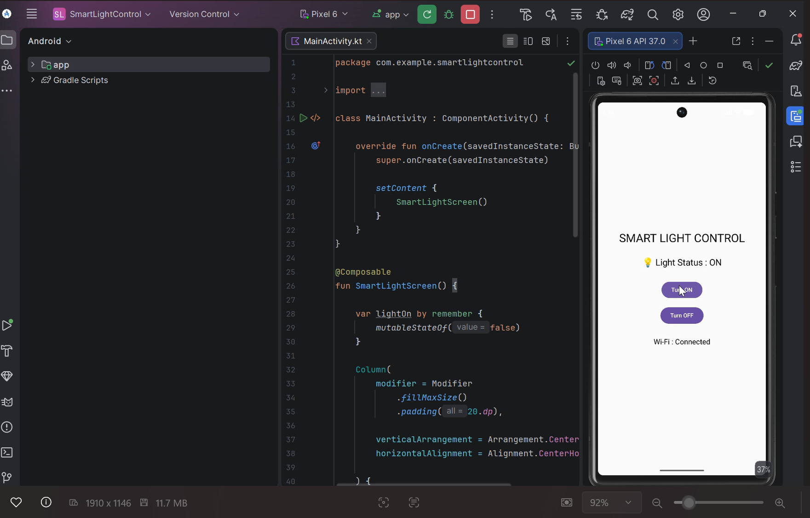

<p align="center">
  
</p>

# 💡 Smart Light Control

A simple Android application developed using **Kotlin** and **Android Studio** that simulates controlling a smart light using ON/OFF buttons.

---

## 📱 Project Overview

Smart Light Control is a beginner-friendly Android application created as part of an internship project.

The application allows users to:

- Turn the light ON
- Turn the light OFF
- View the current light status
- Display Wi-Fi connection status

This project demonstrates the basics of Android app development using Jetpack Compose.

---

## ✨ Features

- 💡 Light ON/OFF Control
- 📶 Wi-Fi Status Display
- 📱 Simple User Interface
- ⚡ Fast and Easy to Use

---

## 🛠️ Technologies Used

- Android Studio
- Kotlin
- Jetpack Compose
- Android Emulator

---

## 📸 Application Preview

<p align="center">
  
</p>

---

## 📂 Project Structure

```
SmartLightControl
│
├── app
├── gradle
├── build.gradle.kts
├── settings.gradle.kts
├── gradlew
├── gradlew.bat
└── README.md
```

---

## 🚀 Future Improvements

- Connect with real IoT devices
- Bluetooth support
- Wi-Fi based smart light control
- Voice Assistant Integration

---

## 👩‍💻 Author

**Abisha S A**

BCA Student

Android Internship Project

---

⭐ Thank you for visiting this project!
